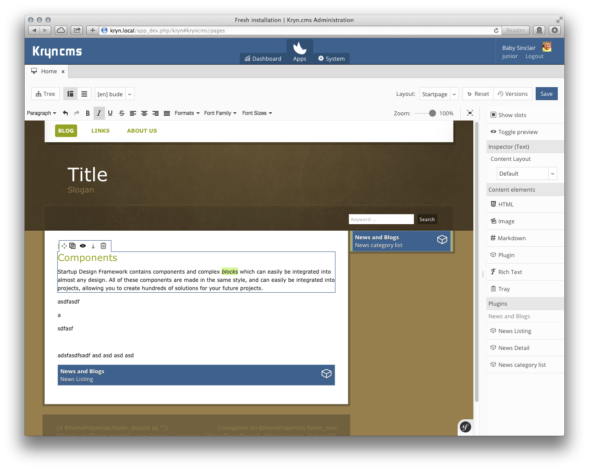
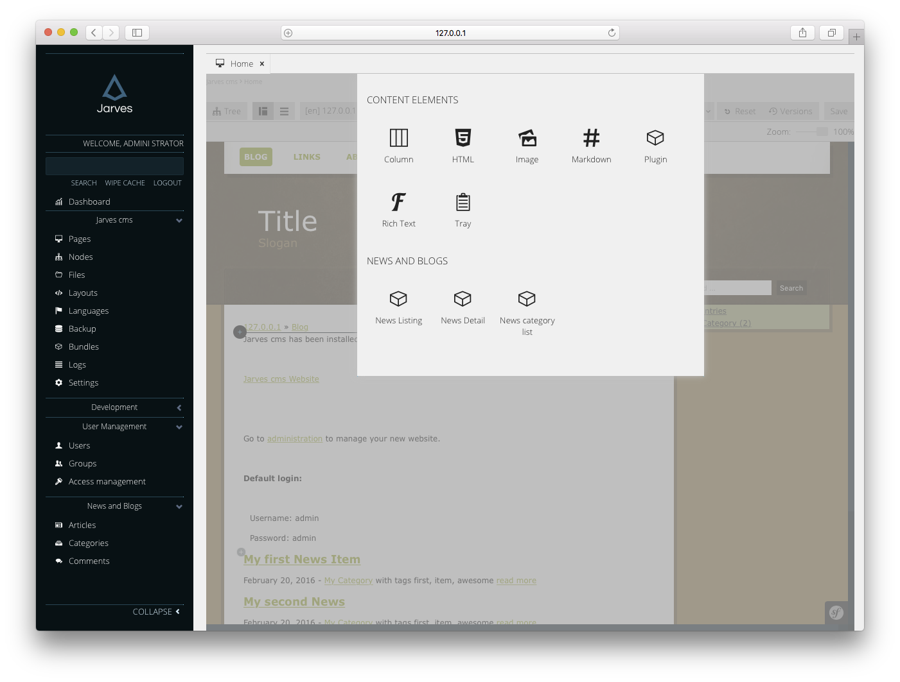
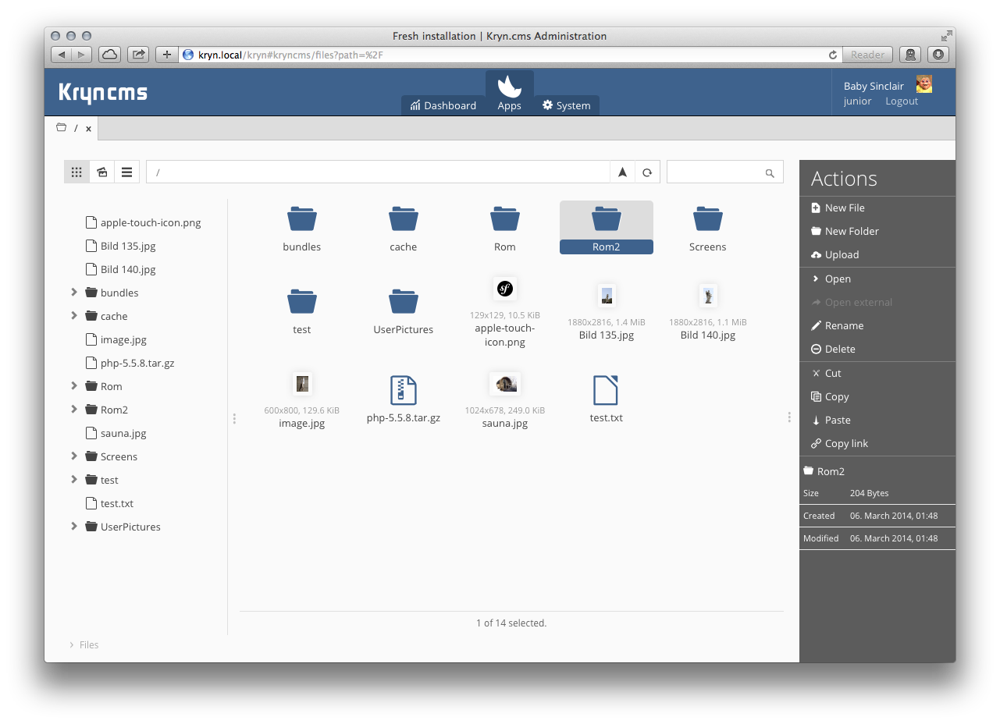
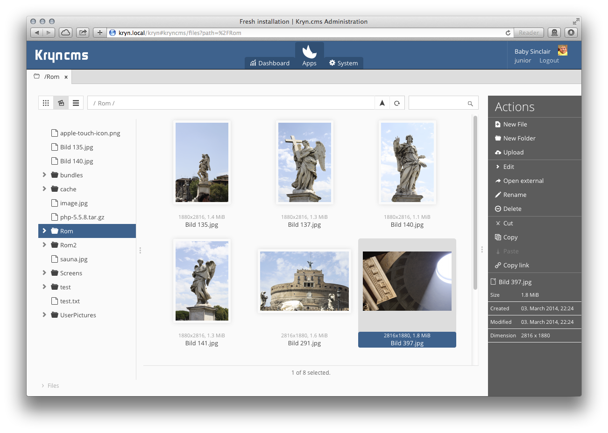
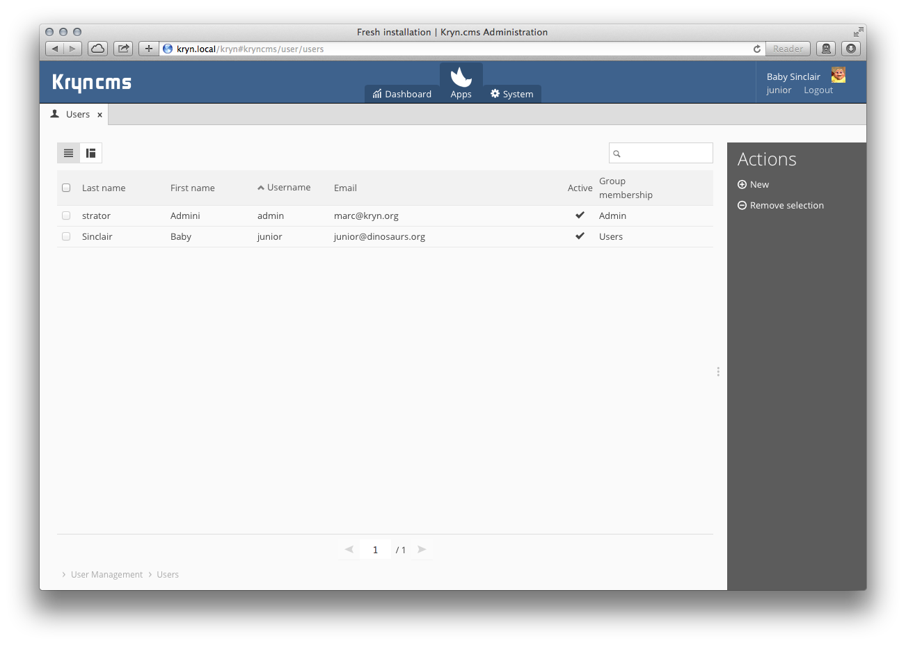
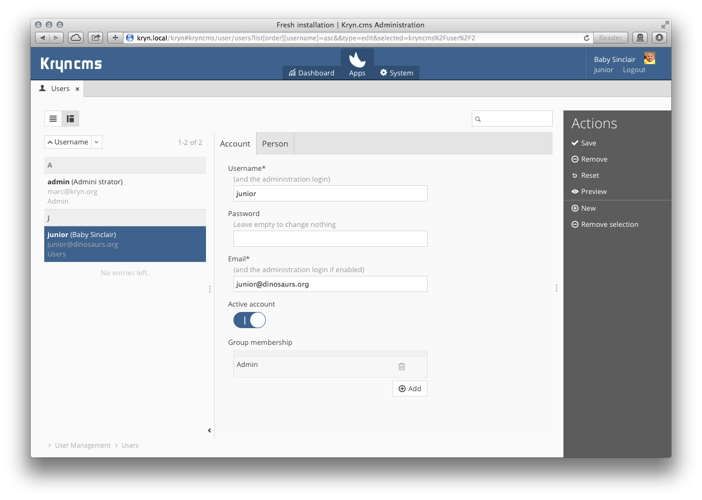

Jarves CMS
========

    

An enterprise and high-speed open-source Content-Management-System (CMS) / Application Framework based on the Symfony framework with a full RESTful API,
a user friendly administration interface and rapid application development (RAD) framework using Composer, Propel and
other rock-solid libraries.

## Status

This project is currently in development and has no releases yet.

If you want to support this project, co-maintain, or participate in another way feel free to contact me.
I'd love to add more people to this organisation and bring it forward.
I invested already several thousand of hours in this project and can probably not bring it alone to an end. Help to make the CMS world a better place. :)

Installation
------------

This describes the customized installation, usually used by developers.

A end-user zip package can be downloaded at http://jarves.io when we've released the first alpha version

Read the [development installation documentation](Resources/doc/installation.md).

Read the [Create A Theme documentation](Resources/doc/create-a-theme.md), to create layouts for your website.

Extensions
----------

This is how a theme extension looks like: https://github.com/jarves/jarves-demotheme

This is how a more details news extension looks like: https://github.com/jarves/jarves-publication

Requirements
------------

1. PHP 5.6+
2. Symfony 3
3. *nix OS (Linux, BSD, OSX)
4. PHP extensions: PDO, mbstring, gd, zip
5. MySQL, PostgreSQL or SQLite

Features
--------

 - Based on Symfony
 - Based on Propel ORM (Propel supports MySQL, PostgreSQL, SQLite, MSSQL, and Oracle), http://www.propelorm.org
 - Advanced, fast and fresh administration interface
 - The administration API is completely abstracted through a [REST API](Resources/doc/images/rest-api.png)
 - File abstraction layer (for mounts with external storages [s3, ftp, dropbox, etc]), CDN
 - i18n using `getText` (with all of its features [e.g. including plural support, contexts]) compatible .po files
 - High-Performance through several cache layers
 - Session storage through several layers (distributed sessions supported)
 - Easy to extend through a fancy extension editor, completely modulized - the symfony way
 - CRUD window generator, without writing one line of code
 - Easy and integrated backup system, perfect for live/dev-scenarios
 - Extremely detailed permission system
 - Ships with a solid bunch of UI input widgets (input fields)
 - Several flexible authentication layers (e.g. changeable for administration, changeable per domain)
 - Secure password storage using up-to-date encryptions
 - Feature-rich inline editing (TinyMCE, Markdown, Drag'n'Drop', etc)
 - Awesome file manager

Screenshot
----------

### Frontend inline editing

### File manager

1. Drag'n'Drop inside the app, from your desktop to Jarves and vice-versa.
2. OSX like preview
3. File editing (rename, delete)
4. Image editing (crop/resize)
5. File Abstraction Layer (for AWS S3 inside Jarves for example)

### CRUD Framework

[More Screenshots](Resources/doc/screenshots.markdown)

More information:
http://jarves.io
