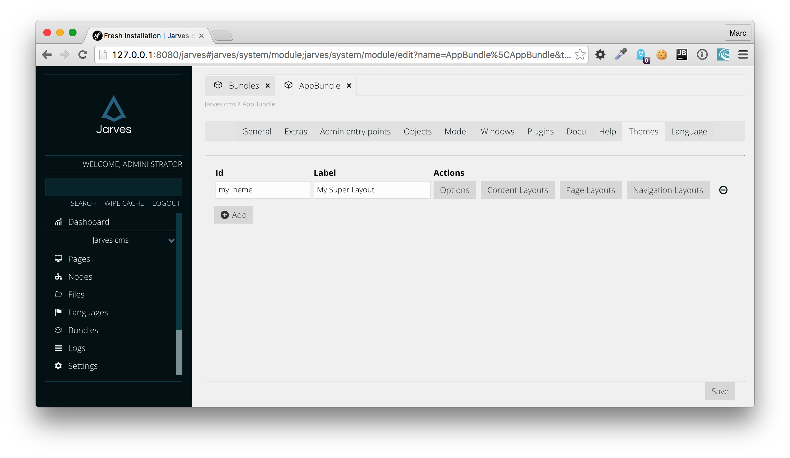
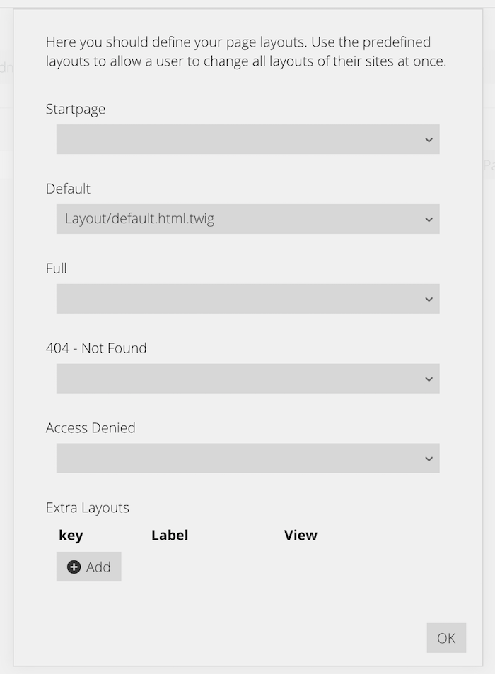
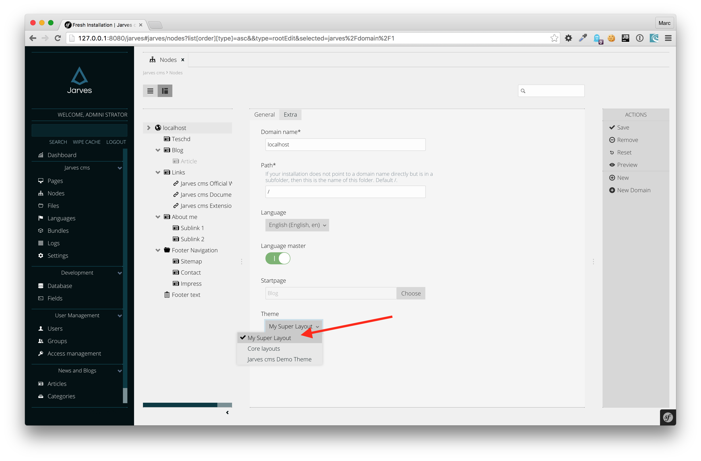
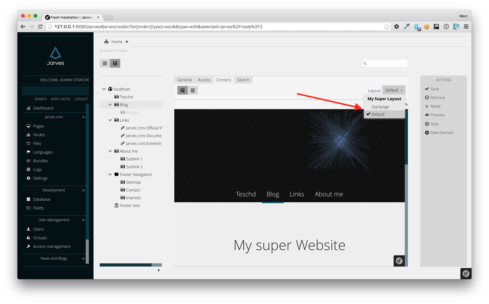
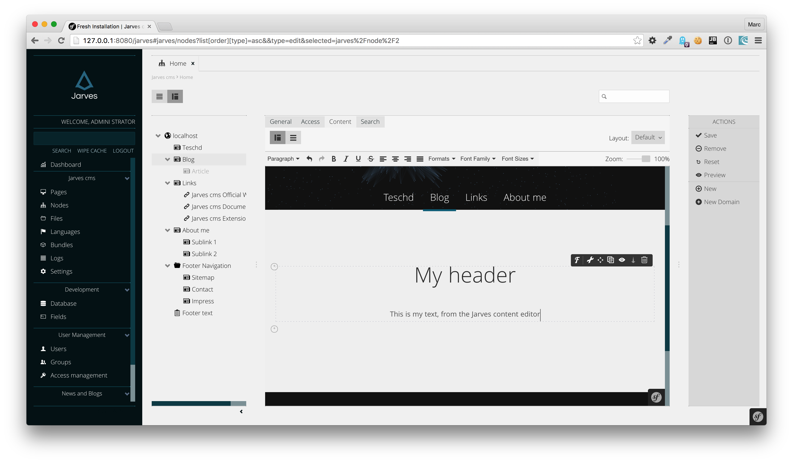

# Create a theme

When you start creating a website the first thing is usually to create a theme, a layout.

Doing so is in Jarves very easy. Below you'll find a step by step tutorial how to create a theme.

In a nutshell:

1. Create a bundle or use AppBundle.
2. Create one or several layouts, e.g `src/AppBundle/Resources/views/Layout/default.html.twig`.
3. Create a theme in Jarves Bundle Editor (administration -> bundles -> development -> edit -> themes) or write the configuration yourself.
4. Use the new theme in a domain (administration -> nodes -> domain).
5. Choose your newly created layouts in pages (administration -> nodes).


## 1. Create a bundle 

Normally, when creating new layouts you do so for your website project, not for third-partys (means installable by others).
Since in Jarves everything is contained in a Symfony bundle, you need first of all a bundle.
Either you have already an `AppBundle` (in `src/AppBundle`) or you need to create it.
 
## 2. Create a layout html file
 
So, since you have a bundle, you now need to create a first layout inside it.
We choose a very typical path for it: `src/AppBundle/Resources/views/Layout/default.html.twig`.

> __Pro tip__: This file is usually referenced in the Symfony way via `AppBundle:Layout/default.html.twig`.

You may already have noticed the file name `default.html.twig` This means we want to generate `.html` using `.twig` template
engine. 

> __Pro tip__: You could register in Symfony additional template engines like Smarty for different template engines, but be aware:
Jarves provides only for Twig the full integration (means functionality like Navigation generation, Content Placeholder, Breadcrumb etc)

  
src/AppBundle/Resources/views/Layout/default.html.twig:

```html
{{ loadAsset('https://code.jquery.com/jquery-2.2.1.min.js') }}`
{{ loadAsset('@AppBundle/css/style.scss') }}
{{ loadAsset('@AppBundle/js/my-super-js') }}

<header id="header">
    <a id="logo" href="/"></a>
    <nav>
        {{ navigationLevel(1) }}
    </nav>
</header>

<section class="main">
    
</section>
<footer>
    <div class="wrapper">
        <div class="pull-right">
            Copyright by websitename.com
        </div>
    </div>
</footer>
```

What you see above is a very typical website structure: A Header, main section with dynamic content and a footer.

### loadAsset function

If you looked closely you might found statements like `{{ loadAsset('@AppBundle/css/style.scss') }}`. What does this mean?

`loadAsset` is a twig function you can use to inject additional resources into you website. Jarves is using these
information and injects `<link>`, `<script>` tags automatically depending on the file path for you.
In addition to that Jarves also has the ability to automatically compile SCSS for you, so you don't need additional build tools.

So, for example, a call `{{ loadAsset('https://code.jquery.com/jquery-2.2.1.min.js') }}` produces:

`<script type="text/javascript" src="https://code.jquery.com/jquery-2.2.1.min.js"></script>`

whereas `{{ loadAsset('@AppBundle/css/style.scss') }}` produces:

`<link rel="stylesheet" type="text/css" href="cache/scss/bundles/app/css/style.css?c=0980bc" >`, which means it compiled
your scss file and placed it into the `web/cache/` folder. If you change this file `app/css/style.scss`
(which is a symlink to `@AppBundle/css/style.scss`, or as real path `src/AppBundle/Resources/public/css/style.scss`)
the generated css will automatically re-generated.

> __Pro tip__: Per default 'resources compression' at the domain is activated (administration -> nodes -> domain).
  Once activated Jarves combines all javascript and css files into two bigger files.

```html
<link rel="stylesheet" type="text/css" href="cache/compressed-css/181a21f7b37d55ea542ac02bbfed67b2.css?c=f2f5cf" >

<script type="text/javascript" src="https://code.jquery.com/jquery-2.2.1.min.js"></script>
<script type="text/javascript" src="cache/compressed-js/58bede386dfceffa916fab97d43cbcd3.js?c=f2f5cf"></script>
```

Above you see the 'Resource compression' in action. As you can see, external resources won't be compressed.

> __Pro tip__: You can also use `loadAsset()` in your plugin templates. Jarves is able to merge the asset information of
your plugin response with the master response.

### Content placeholder

Most websites contain some sort of dynamic content, or content from a database. Jarves brings a content editor
(administration -> Pages, or administraton -> Node and choose a page -> tab 'Content')

A twig statement like `` means that you want at exactly this place content.
If you open the Jarves content editor (administration -> pages) Jarves automatically reads your layout and renders
at the `` editor widgets, where a user can place content like a static text, a plugin, an images etc.

The `1` means an identifier you can choose, Jarves uses to identify this place holder. Note: Only integers allowed.

### Navigation generation

`{{ navigationLevel(1) }}` means you want to place at this position a navigation containing all available nodes
(administration -> Nodes. Types: pages, links, navigations) at the `1`, first level.

Statements like `{{ navigationLevel(2) }}` is also possible and means the second level of the current active navigation
item.

Per default for navigation generation, Jarves uses the template `JarvesBundle:Default/navigation.html.twig`. If you want to use
your own, copy this file into your bundle, for example `src/AppBundle/Resources/views/Navigation/my-navigation.html.twig`
and use it with `{{ navigationLevel(1, 'AppBundle:Navigation/my-navigation.html.twig') }}`.


## 3. Create the theme / Register this file

Creating the file alone is not enough. You need to tell Jarves what this file is and how it should treat it.

This is done in so called themes. In Jarves a theme is a collection of layouts. A layout is typically just a template file.

You can either create a theme in the bundle editor or by creating the configuration file on your own.

### Create a theme using the bundle editor

To use the bundle editor you should open administration -> bundles -> development. Click there 'Edit' at AppBundle.
The bundle editor opens: Click on tab 'Themes'. Click at the left side on 'Add' to create a new blank row. You can
 now enter there an id, which should be unique, and a label (which is displayed in the page layout chooser)



Now you have defined the theme. Next step is to link your tempalte with an layout. Click on the button 'Page layouts':



As you can see, there are several select boxes. Startpage, Default, Full are layouts you can choose for a page in the page editor.
`404 - not Found` and `Access denied` are special layouts, which are being used for cases Jarves needs to print a 404 or a access
denied page. If you want more layouts to choose in the page editor you can add additional using the `Extra layouts` section.

For `Default`, there is already a file selected, which I did. This is exactly
the file we previously created. Per default, you see all `*.html.twig` files in the `Resources/views` folder of the current bundle.

If you create new files in `Resources/views` they appear in these select boxes and you can choose the right file for the right use case.

> __Pro tip__: You can also define theme options (for example a color, or feature switch using a checkbox), but this is not covered
in this tutorial, since mostly only themes that are distributed for third-partys are using this feature.

If you configured everything correctly, you should click 'Save' at the bottom right, to let Jarves create for you the configuration
in  `src/AppBundle/Resources/config/jarves.themes.xml`. Make sure Jarves correctly wrote the file by checking the folder
 `src/AppBundle/Resources/config/`.

### Create the configuration xml

If you don't want to use the bundle editor, you can create the configuration file yourself.

Jarves configuration files are located usually at `src/AppBundle/Resources/config/jarves.*.xml`. All files with this pattern
is automatically loaded and merged, parsed and read by Jarves/Configuration classes (for example `Jarves/Configuration/Theme.php`).

The bundle editor uses for theme settings the file `src/AppBundle/Resources/config/jarves.themes.xml`, so we should (but not a must) do the same.

> __Pro tip__: If you choose a different name like `jarves.xml`, you can do that. The bundle editor is able to detect where `<themes>`
has been configured and uses the detected file for further adjustments.

So, enough talked. Here is the file:

```xml
<config>
    <bundle>
        <themes>
            <theme id="app">
                <label>App Themes</label>
                <layouts>
                    <layout key="startpage">
                        <file>AppBundle:Layout/startpage.html.twig</file>
                    </layout>
                    <layout key="default">
                        <file>AppBundle:Layout/default.html.twig</file>
                    </layout>
                </layouts>
            </theme>
        </themes>
    </bundle>
</config>
```

To understand all the `key`, `id`, `<label>` stuff please take a look into `Create a theme using the bundle editor`, section above.
 
 
### Use the theme

After creating all necessary files using the bundle editor or the configuration file directly, you should reload Jarves administration.

Per default, Jarves scopes all available layouts for pages by the chosen theme in their domain. So you need to choose your newly created theme
in the domain you want use it. All pages inside this domain can now choose layouts from the defined theme.



Next, you can open a page and choose between your layouts:



The editor will reload automatically if you change the layout.

### Manage content

Since you have used `` in your layout, you can manage content at these places using the Jarves content editor:





## Done

You're done. 🎉 You created successfully your first page layout, configured a theme and used it in one page. 🎉
